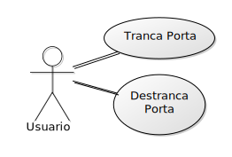

# Casos de uso

## 1. Diagrama de casos de uso

**Funcionalidades do Usuário**

## 2. Especificação dos casos de uso

**Funcionalidades do Usuário**

### 2.1. Caso de uso **Tranca Porta**

| Campo          | Informação        |
|---|---|
| Identificador: | UC01              |
| Nome:          | Tranca Porta |
| Atores:        | Usuario |
| Sumário:       | Envia comando para trancar a porta |

| Fluxo Principal |
|---|
| 1) O usuario seleciona a opção **Tranca Porta**. |
| 2) O sistema envia comando de travar para a porta . |
| 3) O hardware recebe o comando de travar a porta e ativa a tranca. |

| Fluxo Alternativo (2a): O hardware está sem internet e o sistema não consegue enviar o comando. |
|---|
| 1) O sistema informa que não conseguiu de travar para a porta. |
| 2) O usuario apera botão no hardware que tranca a porta. |

### 2.1. Caso de uso **Destranca Porta**

| Campo          | Informação        |
|---|---|
| Identificador: | UC02              |
| Nome:          | Destranca Porta |
| Atores:        | Usuario |
| Sumário:       | Envia comando para destrancar a porta |

| Fluxo Principal |
|---|
| 1) O usuario seleciona a opção **Destranca Porta**. |
| 2) O sistema envia comando de destravar para a porta . |
| 3) O hardware recebe o comando de destravar a porta e desativa a tranca. |

| Fluxo Alternativo (2a): O hardware está sem internet e o sistema não consegue enviar o comando. |
|---|
| 1) O sistema informa que não conseguiu de travar para a porta. |
| 2) O usuario apera botão no hardware que destrancar a porta. |

**Instruções do professor**: As tabelas acima mostram um exemplo de especificação de **um único caso de uso**. Lembre-se de especificar cada um dos casos de uso.

